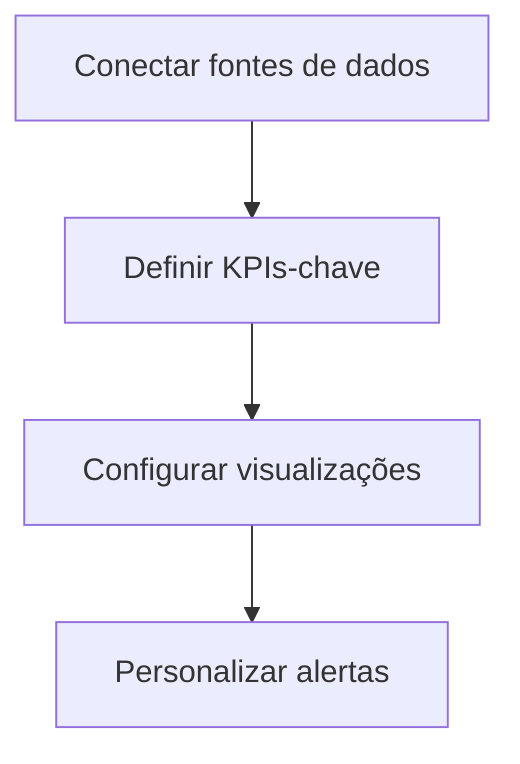

# Como Gerenciar RPAs Visualmente: Guia Prático

Gerenciar RPAs (Robotic Process Automation) visualmente permite monitorar e controlar seus fluxos de automação de forma intuitiva. Aqui estão as principais abordagens:

## Ferramentas Visuais para Gestão de RPA

1. **Painéis de Controle (Dashboards)**

   - ❌**UiPath Orchestrator**: Oferece visão geral de todos os bots em execução
   - **❌Automation Anywhere Control Room**: Monitoramento em tempo real
   - **❌Power Automate Portal**: Interface visual da Microsoft
2. **Componentes Visuais Essenciais**

   - Mapas de calor de execução
   - Gráficos de desempenho por processo
   - Alertas visuais para falhas

## Como Implementar o Gerenciamento Visual

### 1. Configuração de Dashboards

### 2. Principais Métricas para Visualizar

- ✅ Taxa de sucesso das execuções
- ⏱ Tempo médio de processamento
- 🔴 Falhas por tipo de erro
- 📊 Volume de transações processadas

### 3. Ferramentas Complementares

- **Power BI**: Para dashboards avançados

## Melhores Práticas

1. **Hierarquia Visual**:

   - Nível estratégico (visão geral)
   - Nível tático (por departamento)
   - Nível operacional (por bot/processo)
2. **Cores Semânticas**:

   - Verde: Operação normal
   - Amarelo: Atenção necessária
   - Vermelho: Intervenção imediata
3. **Visualizações Recomendadas**:

   - Gantt charts para agendamentos
   - Fluxogramas interativos
   - Terminais de execução em tempo real

## Plataformas com Boas Interfaces Visuais
